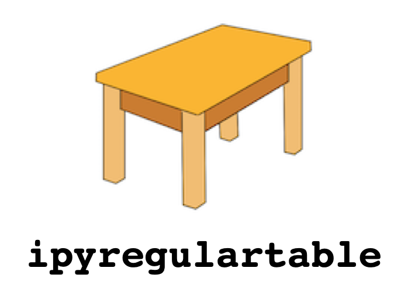

<p align="center">

</p>

# ipyregulartable

An [ipywidgets](https://github.com/jupyter-widgets/ipywidgets) wrapper around
[regular-table](https://github.com/finos/regular-table) for Jupyter.

[](https://github.com/finos/ipyregulartable/actions/workflows/build.yaml)
[](https://codecov.io/gh/finos/ipyregulartable)
[](https://github.com/finos/ipyregulartable)
[](https://pypi.python.org/pypi/ipyregulartable)
[](https://www.npmjs.com/package/ipyregulartable)
[](https://community.finos.org/docs/governance/software-projects/stages/incubating)
[](https://mybinder.org/v2/gh/finos/ipyregulartable/main?urlpath=lab)

## Examples

### Two Billion Rows

[Notebook](https://raw.githubusercontent.com/finos/ipyregulartable/main/docs/examples/two_billion.ipynb)


### Click Events

[Notebook](https://raw.githubusercontent.com/finos/ipyregulartable/main/docs/examples/click_events.ipynb)


### Edit Events

[Notebook](https://raw.githubusercontent.com/finos/ipyregulartable/main/docs/examples/edit_events.ipynb)


### Styling

[Notebook](https://raw.githubusercontent.com/finos/ipyregulartable/main/docs/examples/styling.ipynb)


### Pandas Data Model

For interactive or streaming sorting, pivoting, and aggregation, see
[Perspective](https://github.com/finos/perspective), which also uses
[`regular-table`](https://github.com/finos/regular-table).

#### Series


#### DataFrame


#### DataFrame Row Pivots


#### DataFrame Column Pivots


#### DataFrame Pivot Table


## Installation

### PyPI

```bash
pip install ipyregulartable
```

### Conda

```bash
conda install -c conda-forge ipyregulartable
```

For Jupyter Notebook 5.2 or earlier, enable the classic notebook extension:

```bash
jupyter nbextension enable --py --sys-prefix ipyregulartable
```

## Data Model

Custom data models implement the abstract methods on the base `DataModel`
class:

```python
class DataModel(with_metaclass(ABCMeta)):
    @abstractmethod
    def editable(self, x, y):
        """Return whether the cell at (x, y) is editable."""

    @abstractmethod
    def rows(self):
        """Return the total number of rows."""

    @abstractmethod
    def columns(self):
        """Return the total number of columns."""

    @abstractmethod
    def dataslice(self, x0, y0, x1, y1):
        """Return a data slice, inclusive of both coordinate pairs."""
```

Any `DataModel` object can be passed to `RegularTableWidget`.
`regular-table` may make probing calls with `(0, 0, 0, 0)` to assess data
limits.

## License

Licensed under the Apache License 2.0. See [LICENSE](LICENSE),
[NOTICE](NOTICE), and [AUTHORS](AUTHORS).

> [!NOTE]
> This library was generated using [Copier](https://copier.readthedocs.io/en/stable/)
> from the
> [Base Python Project Template](https://github.com/python-project-templates/base).
